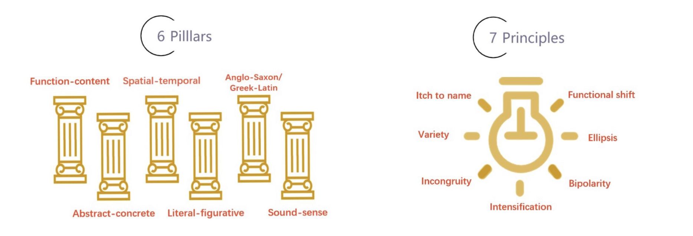

#  Thinking Parrot (有脑鹦鹉)

An AI-assisted, concept-first approach to mastering English. This project promotes a new way to learn that goes beyond grammar drills and vocabulary lists, focusing instead on the concepts and patterns native speakers use unconsciously.

## Why this approach

This method aims to answer three practical questions for learners (especially native Chinese speakers):

- Why is there a persistent bottleneck and what blind spots do learners overlook when studying English as a second language?
- Why can you understand every word in a sentence but still miss the meaning? The “comprehension challenge” is real and different from Chinese.
- What does it mean to think in English and write authentic English? Like cooking, you must know the ingredients and a reliable recipe before you can create.

## How it works

The approach is holistic, multi-layered and 360°:

- We promote creative learning, not rote learning.
- We adopt a reverse-engineering mindset: take language apart, then reassemble to build your own style.
- We help you “learn to look”, “learn to think”, and “learn to play” with English through new concepts.

You will quickly raise awareness, simplify the complex, and gain a durable mental model of English usage.

## Learning Program

The English learning program is implemented in a WeChat Mini Program that provides various tools to help and motivate learners, such as collection, daily check-in, and rank list. The whole learning process is divided into six levels: the first four levels (concept introduction, multiple choices, and oral questions) are implemented, while the chatbot represents the final level—putting learners into realistic English settings to help them master concept learning through daily conversation. The chatbot engine uses advanced Chaotic Neural Oscillatory LSTM technology ([Language-Chatbot-3.0](https://github.com/liafonx/Language-Chatbot-3.0.git)) to provide more natural and contextually aware conversations.

## Pillars & Principles

The visual above summarizes the 6 Pillars and 7 Principles that structure this learning method. The pillars capture the major dimensions of English usage (such as function vs. content or literal vs. figurative), while the principles highlight actionable tendencies native speakers rely on (such as variety, intensification, ellipsis). Use the diagram as a quick reference: identify which pillar a sentence operates on, then apply the relevant principles to generate or refine your expression.

## Architecture

This repository contains the learning methodology and reference materials. The complete system follows a client-server architecture with two main components:

**Frontend** - WeChat Mini Program built with JavaScript/WXML/WXSS  
[ThinkingParrot-Miniprogram](https://github.com/liafonx/ThinkingParrot-Miniprogram.git)

**Backend** - Django-based Python API service handling conversational AI and learning assessments  
[ThinkingParrot-Backend](https://github.com/liafonx/ThinkingParrot-Backend.git)

The Mini Program communicates with the backend through RESTful APIs, sending user interactions and receiving structured responses (lessons, feedback, assessments). This modular design allows independent development and deployment of the user interface and core learning engine.

**AI Chatbot Engine** - Advanced conversational AI using Chaotic Neural Oscillatory LSTM technology  
[Language-Chatbot-3.0](https://github.com/liafonx/Language-Chatbot-3.0.git)

The chatbot engine integrates with the backend service to power the sixth level of the learning program. It processes natural language conversations, applies the conceptual learning framework, and provides contextually appropriate responses that help learners practice English in realistic scenarios.

## Materials

- Poster overview: `Language Chatbot 3.0 Poster.pdf` (high-level introduction to the method, pillars, and principles)

